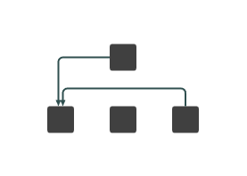

# architecture-diagram

in development

```js
var G = `digraph G {
node1[label="node 1"];
node2[label="node 2"];
node3[label="node 3"];
node4[label="node 4"];
node1 -> node2[label="()"];
node2 -> node4[label="()"];
node2 -> node3[label="()"];
node2 -> node1[label="()"];
node1 -> node2[label="()"];
}
`;
```

```js
var size = [700, 700];
var grouppadding = 0.01;
var margin = 20;
var groupMargin = 15;
var nudgeGap = 5;
```

```js
var digraph = graphlibDot.read(G);
```

```js
var graph = {
    nodes: [],
    links: []
}

digraph.nodes().forEach((nodeName, i) => {
    let node = digraph._nodes[nodeName];
    node.id = i;
    node.name = nodeName;
    node.width = 70;
    node.height = 70;
    graph.nodes.push(node);
});

for (let edge of digraph.edges()) {
    graph.links.push({
        source: digraph._nodes[edge.v].id,
        target: digraph._nodes[edge.w].id
    });
}
```

```js
var pgLayout = cola.powerGraphGridLayout(graph, size, grouppadding);

// pgLayout.powerGraph.groups = [];
pgLayout.powerGraph.powerEdges = [];

pgLayout.powerGraph.powerEdges.push(
    {
        source: graph.nodes[3],
        target: graph.nodes[1],
        type: 0
    },
    {
        source: graph.nodes[0],
        target: graph.nodes[1],
        type: 0
    }
    
)
```

```js
var routes = cola.gridify(pgLayout, nudgeGap, margin, groupMargin);
```

```js
// svg
var svg = d3.select("body").append("svg")
    .attr("width", size[0])
    .attr("height", size[1]);

var node = svg.selectAll(".node")
    .data(graph.nodes)
    .enter().append("rect")
    .attr("x", d => d.routerNode.bounds.x)
    .attr("y", d => d.routerNode.bounds.y)
    .attr("width", d => d.routerNode.bounds.width())
    .attr("height", d => d.routerNode.bounds.height())
    .attr("class", "node")
    .attr("fill", "black")

routes.forEach(route => {
    var cornerradius = 5;
    var arrowwidth = 3;
    var arrowheight = 7;
    var p = cola.GridRouter.getRoutePath(route, cornerradius, arrowwidth, arrowheight);
    // console.log("p", p)
    svg.append("path")
        .attr("class", "link")
        .attr("d", p.routepath)
        .attr("fill", "none")
        .attr("stroke", "black")
        .attr("stroke-width", 2);
    svg.append("path")
        .attr("class", "linkarrow")
        .attr("d", p.arrowpath)
        .attr("stroke", "black")
        .attr("stroke-width", 2);    
});
```

